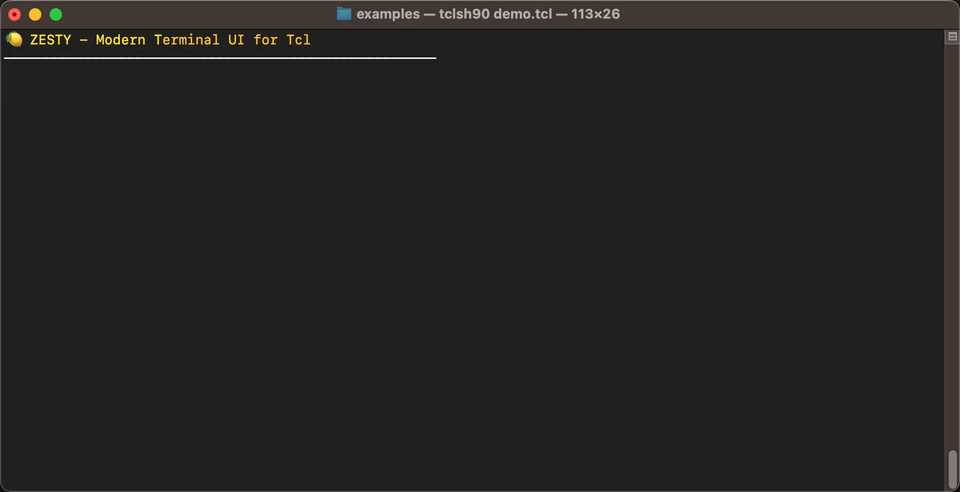

# 🍋 zesty
<p align="center">
  
</p>
Create beautiful command-line interfaces with styled text, progress bars, tables, boxes, and JSON formatting.

#### ✨ Features :

- 🎨 Rich Text Styling - 256 colors, text formatting, gradients.   
- 📊 Progress Bars - Multiple tasks, animations, custom columns.  
- ⏳ Status - Animated spinner with a message while a script runs.  
- 📋 Tables - Auto-sizing, text wrapping, scrolling, styling.  
- 📦 Boxes - Multiple border styles, title positioning, padding.  
- ➖ Rules - Horizontal separators with an optional title.  
- 🌳 Trees - Tree views from nested dictionaries.  
- 🔧 JSON Decoder - Pretty-print JSON with syntax highlighting.
- 🖍️ Code Highlights - Tcl code syntax highlighting powered by tree-sitter, with line numbers, whitespace and indent guides.

## Requirements :
- [Tcl](https://www.tcl.tk/) 8.6 or higher
- Platform-specific requirements:
  - Windows: 
    - [twapi](https://github.com/apnadkarni/twapi) or [tcl-cffi](https://github.com/apnadkarni/tcl-cffi) >= 2.0
  - Unix/Linux: 
    - Terminal with ANSI escape sequence support
#### Optional Dependencies :
- [Thread](https://core.tcl-lang.org/thread) package (For progress bars)
- huddle::json package from [Tcllib](https://core.tcl-lang.org/tcllib/doc/trunk/embedded/index.md) (For JSON formatting)
- [tst](https://github.com/nico-robert/tst) package (For code Tcl syntax highlighting)

## Cross-Platform :
- Windows, Linux, macOS support.
> [!IMPORTANT]  
> Primary testing has been conducted on Windows (both Windows `Terminal.exe` and `cmd.exe`) and macOS. Linux compatibility is expected but may require additional validation.

## Quick Start :
🎨 Echo
```tcl
# Import echo command to avoid namespace qualification:
namespace import zesty::echo

# Basic styled text
echo "Hello World!" -style {fg red bold 1}

# Inline style tags
echo "This is <s fg=red>red color</s> and <s fg=blue bold=1>bold blue</s>"

# Gradient effect
echo [zesty::gradient "Rainbow Text" "red" "yellow"]

# Apply a filter to the numerical values.
echo "1. Basic Echo" -filters {num {fg cyan}}

# Clickable links (e.g. Ctrl+click in Windows Terminal)
echo "Docs: https://www.tcl-lang.org" -filters {url {fg blue underline 1 link 1}}
echo "See <s fg=blue underline=1 link=https://www.tcl-lang.org>the Tcl website</s>"

```
📊 Progress Bars
```tcl
# Simple progress bar
set bar [zesty::Bar new]
set task [$bar addTask -name "Downloading..." -total 100]

# Practical procedure for managing the Tcl event loop :
zesty::loop -start 0 -end 100 -delay 50 {
    $bar advance $task 1
}
```
⏳ Status
```tcl
# Spinner while the script runs, then the message stays on screen
zesty::status "Connecting to database..." {
    connect_db
}
echo "<s fg=green>Connected</s>"
```
📋 Tables
```tcl
# Create a styled table
set table [zesty::Table new \
    -title {name "Sales Report" style {fg blue bold 1}} \
    -box {type "rounded"}
]

$table addColumn -name "Product" -width 20
$table addColumn -name "Price" -justify "right"
$table addColumn -name "Stock" -justify "center"

$table addRow "Laptop" "\$1,299" "15"
$table addRow "Mouse" "\$29" "125"

$table display
```
📦 Boxes
```tcl
# Simple box with title
echo [zesty::box \
    -title {name "Info" anchor "nc"} \
    -content {text "Your content here"} \
    -padding 2
]
```
➖ Rules
```tcl
# Full terminal width rule with a centered title
echo [zesty::rule -title {name "Section"}]

# Left aligned title, custom character and maximum width
echo [zesty::rule -title {name "Results" align left} -char "═" -width 40]
```
🌳 Trees
```tcl
# Each key is a node, its value is the dictionary of its children
set project {
    src {bar {core.tcl {} render.tcl {}} utils.tcl {}}
    README.md {}
}
echo [zesty::tree $project -root "zesty" -type rounded]
```
🔧 JSON Formatting
```tcl
# Pretty-print JSON with syntax highlighting
set json {{"name": "John", "age": 30, "active": true}}
echo [zesty::jsonDecode -json $json]

# Custom styling for JSON elements
echo [zesty::jsonDecode -json $json -showLinesNumber 1 -style {
    key {fg cyan}
    str {fg yellow}
    num {fg green}
    null {fg red}
    boolean {fg blue bold 1}
    lineNum {fg 254 reverse 1}
}]
```
🖍️ Code Highlights
```tcl
# Syntax-highlight a block of Tcl code
set code {
proc hello {name} {
    puts "Hello, $name!"
}
}

echo [zesty::codeHighlights -code $code -linesNumber {show true}]

# Custom colors per token type + whitespace/indent guides
echo [zesty::codeHighlights -code $code \
    -style {keyword {fg cyan bold 1} string {fg green} comment {fg 8 italic 1}} \
    -whiteSpace {show true} \
    -verticalGuides {show true}
]
```
## Documentation :

### Echo command :
The `zesty::echo` command provides styled console output:
```tcl
zesty::echo text ?options?
````
#### Options:

| args           | Description               
| ------         | ------                    
| _-style_       | Style specifications      
| _-filters_     | Apply style filters (num, email, url). Use `link 1` in the url or email style to make links clickable
| _-command_     | Command to execute on the text before display
| _-escape_map_  | Key-value pairs for escaping style tag characters
| _-n_           | No newline        
| _-noreset_     | Don't reset formatting      
| _-raw_         | Display raw text, bypassing style parsing

### Progress Bars command :

> [!IMPORTANT]    
> Progress bars are rendered by a dedicated display thread ([Thread](https://core.tcl-lang.org/thread) package required).
> Animations, spinners and time columns keep updating even while your code is blocked (long computation, synchronous I/O, `after` ms...).  
> Custom columns and `-format` callbacks run in your interpreter: they are refreshed on each method call (`advance`, `update`...),
> or between calls only while the Tcl event loop is running.  
> While a bar is live, write messages with `zesty::echo`: they are displayed above the bars (a plain `puts` may be overwritten).  
> To display a message below a finished bar, write it after `$bar destroy`.

> [!TIP]    
> Each method call on a bar is a synchronous round trip to the display thread (a few tens of microseconds).
> In very tight loops, advance by batches, e.g. `$bar advance $task 1000` every 1000 items instead of 1000 calls.

Create a progress bar with default columns and options :
```tcl
set bar [zesty::Bar new ?options?]
```
#### Options:
| args                      | Description               
| ------                    | ------                    
|_-minColumnWidth_          | minimum column width
|_-minBarWidth_             | minimum progress bar width 
|_-ellipsisThreshold_       | threshold for ellipsis display
|_-barChar_                 | character for progress bar fill
|_-bgBarChar_               | character for progress bar background
|_-leftBarDelimiter_        | left delimiter for progress bar
|_-rightBarDelimiter_       | right delimiter for progress bar
|_-indeterminateBarStyle_   | animation style (bounce, pulse, wave)
|_-spinnerFrequency_        | spinner update frequency in ms
|_-indeterminateSpeed_      | animation speed
|_-setColumns_              | custom column configuration
|_-colorBarChar_            | color for progress bar fill
|_-colorBgBarChar_          | color for progress bar background
|_-headers_                 | custom header configuration
|_-lineHSeparator_          | custom header separator configuration

#### Default column types are:

- zName - Task description
- zBar - Progress bar
- zPercent - Percentage
- zCount - Current/Total
- zElapsed - Elapsed time
- zRemaining - ETA
- zSpinner - Animated spinner
- zSeparator - Column separator

> [!TIP]    
> You can create your own column types.   

### Status command :
Displays an animated spinner followed by a message while a script runs:
```tcl
zesty::status ?options? message script
```
#### Options:
args                            |Description
| ------                        | ------                    
|_-spinner_                     | spinner style: dots (default), line, circle, emoji, arrows, bars, moon

The script is evaluated in the caller's context and its result is returned.
When the script ends, the spinner is removed and the message (which may contain
style tags) stays on screen. Errors are propagated to the caller.

### Tables command :
Create formatted tables with automatic sizing:
```tcl
set table [zesty::Table new ?options?]
```
#### Options:
args                  |Description
| ------              | ------                    
|_-title_             | Table title
|_-caption_           | Table caption
|_-box_               | Table box style
|_-padding_           | Table padding
|_-showEdge_          | Show table edge
|_-lines_             | Show table lines
|_-header_            | Show table header
|_-keyPgup_           | Key for page up
|_-keyPgdn_           | Key for page down
|_-keyQuit_           | Key for quit
|_-maxVisibleLines_   | Maximum number of visible lines
|_-autoScroll_        | Enable auto-scrolling
|_-pageScroll_        | Enable page scrolling
|_-continuousScroll_  | Enable continuous scrolling
|_-footer_            | Show table footer.   


### Boxes command :
Create styled text boxes:
```tcl
zesty::box ?options?
```
#### Options:
args                            |Description
| ------                        | ------                    
|_-title_                       | title configuration
|_-content_                     | content configuration
|_-box_                         | box appearance settings
|_-padding_                     | uniform padding (higher priority than paddingX and paddingY)
|_-paddingX_                    | horizontal padding
|_-paddingY_                    | vertical padding
|_-formatCmdBoxMsgtruncated_    | truncation callback command

### Rule command :
Create horizontal rules, with an optional title:
```tcl
zesty::rule ?options?
```
#### Options:
args                            |Description
| ------                        | ------                    
|_-title_                       | title configuration (name, style, align: left, center or right)
|_-style_                       | style of the line
|_-char_                        | character used to draw the line (default `─`)
|_-width_                       | maximum width (default: terminal width)

### Tree command :
Create tree views from nested dictionaries (each key is a node, its value is
the dictionary of its children, empty for a leaf). Node names may contain style tags:
```tcl
zesty::tree data ?options?
```
#### Options:
args                            |Description
| ------                        | ------                    
|_-root_                        | root label displayed on the first line
|_-type_                        | guides type, same as tables: single (default), double, rounded, thick, ascii
|_-style_                       | style of the guides

### JSON decoder command :
The `zesty::jsonDecode` command formats JSON with syntax highlighting:
```tcl
zesty::jsonDecode ?options?
```
#### Options:
args                            |Description
| ------                        | ------                    
|_-json_                        | JSON data to decode
|_-dumpJSONOptions_             | formatting huddle options
|_-style_                       | styling specifications
|_-showLinesNumber_             | whether to show line numbers

### Code Highlights command :
The `zesty::codeHighlights` command syntax-highlights `Tcl` code using tree-sitter (via the [tst](https://github.com/nico-robert/tst) package):
```tcl
zesty::codeHighlights ?options?
```
#### Options:
args                    |Description
| ------                | ------
|_-code_                | Tcl code to highlight
|_-style_                | style specifications per token type (keyword, expression, string, number, tcloo, function, comment, pBrace, pBracket, delimiter, parent, conditional, namespace, custom)
|_-linesNumber_          | show/style line numbers
|_-whiteSpace_           | show/style visible whitespace characters
|_-verticalGuides_       | show/style vertical indent guides
|_-scmFile_              | custom `.scm` tree-sitter query file
|_-isUTF8_               | whether the input code is already UTF-8 encoded
|_-words_                | list of custom words to highlight with the `custom` style
|_-maxlen_               | maximum line length before truncation (defaults to terminal width)

> [!NOTE]
> Requires the [tst](https://github.com/nico-robert/tst) package to be installed for code Tcl syntax highlighting.

### Color support :  
**zesty** supports multiple color formats:
```tcl
-style {
    fg "red"     ; # Named colors
    fg 196       ; # Numbered colors.
    fg "#FF5733" ; # Hex colors
}
```
**zesty** respects the [NO_COLOR](https://no-color.org) convention: when the `NO_COLOR` environment
variable is set to a non-empty value, no color is output. Other styles (bold, underline...) and hyperlinks are kept.

**zesty** uses XML-like tags for inline styling:
```xml
<!--
Simple color or color with formatting.
Tags can be nested and combined.
-->
<s fg=red>text</s>
<s fg=blue bold=1>text</s>
```

_Refer to `colors.tcl` file for the complete 256-color palette specification and terminal capability detection._
## Examples :
See the **[examples](/examples)** folder for all demos.

## License : 
**zesty** is covered under the terms of the [MIT](LICENSE) license.

## Acknowledgments :
Inspired by modern CLI tools and libraries

## Changes :
*  **15-Jun-2025** : 0.1
    - Initial release.
*  **03-Jul-2025** : 0.2
    - Improved `Windows` Terminal detection
    - Enhanced args parsing.
    - Merged `cwin32.tcl` and `twin32.tcl` into `win32.tcl`
    - Adds _-encoding_ `utf-8` option to `source` command for   
      compatibility with `Windows` Tcl8.6 support.
    - Adds `common.tcl` file to facilitate common functions.
    - Adds `footer` support for class `Table`.
    - Major code refactoring.
    - Fixes minor bugs.
*  **29-Sep-2026** : 0.3
    - Adds `zesty::codeHighlights` command (Tcl syntax highlighting with tree-sitter).
    - Adds `zesty::rule`, `zesty::status` and `zesty::tree` commands.
    - Adds clickable links for urls, emails and inline tags.
    - Adds `-raw` and `-escape_map` options to `zesty::echo`.
    - Adds `-padding` option to `zesty::box` (fix #1, thanks @Hoffenbar).
    - Adds `zesty::setTerminalTitle` (camelCase name).
    - Adds `NO_COLOR` environment variable support.
    - Progress bars run in a dedicated display thread.
    - Errors no longer clear the terminal screen.
    - Fixes `win32.tcl` loading on all Windows platforms.
    - Fixes `zesty::echo -command` with multi-word commands.
    - Fixes extra trailing space in `zesty::echo`.
    - New examples: `zprogress_threaded`, `zrule`, `zstatus`, `ztree`.