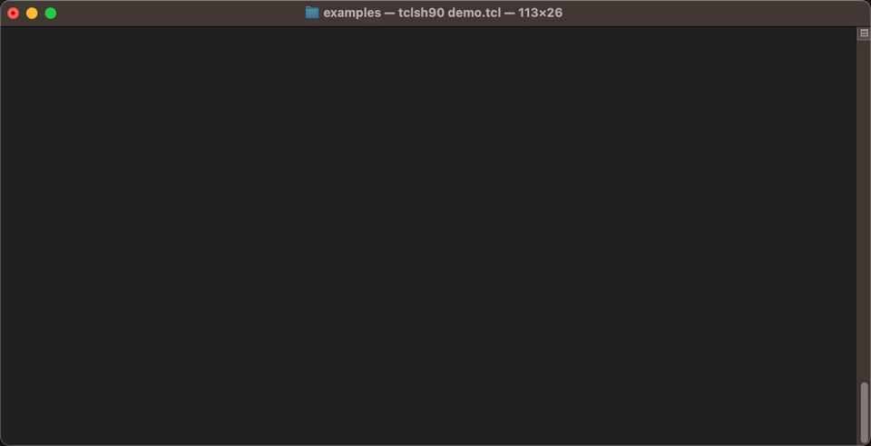

# 🍋 zesty
<p align="center">
  
</p>
Create beautiful command-line interfaces with styled text, progress bars, tables, boxes, and JSON formatting.

#### ✨ Features :

- 🎨 Rich Text Styling - 256 colors, text formatting, gradients.   
- 📊 Progress Bars - Multiple tasks, animations, custom columns.  
- 📋 Tables - Auto-sizing, text wrapping, scrolling, styling.  
- 📦 Boxes - Multiple border styles, title positioning, padding.  
- 🔧 JSON Decoder - Pretty-print JSON with syntax highlighting.

## 🛠️ Requirements :
- [Tcl](https://www.tcl.tk/) 8.6 or higher
- Platform-specific requirements:
  - Windows: 
    - [twapi](https://github.com/apnadkarni/twapi) or [tcl-cffi](https://github.com/apnadkarni/tcl-cffi) >= 2.0
  - Unix/Linux: 
    - Terminal with ANSI escape sequence support
- huddle::json package from [Tcllib](https://core.tcl-lang.org/tcllib/doc/trunk/embedded/index.md) (optional for JSON formatting)

## 🎯 Cross-Platform :
- Windows, Linux, macOS support.
> [!NOTE]  
> Primary testing has been conducted on Windows (both Windows `Terminal.exe` and `cmd.exe`) and macOS. Linux compatibility is expected but may require additional validation.
## 🚀 Quick Start :

Echo
```tcl
# Import echo command to avoid namespace qualification:
namespace import zesty::echo

# Basic styled text
echo "Hello World!" -style {fg red bold 1}

# Inline style tags
echo "This is <s fg=red>red color</s> and <s fg=blue bold=1>bold blue</s>"

# Gradient effect
echo [zesty::gradient "Rainbow Text" "red" "yellow"]

# Apply a filter to the numerical values.
echo "1. Basic Echo" -filters {num {fg cyan}}

```
📊 Progress Bars
```tcl
# Simple progress bar
set bar [zesty::Bar new]
set task [$bar addTask -name "Downloading..." -total 100]

# Practical procedure for managing the Tcl event loop :
zesty::loop -start 0 -end 100 -delay 50 {
    $bar advance $task1 1
}
```
📋 Tables
```tcl
# Create a styled table
set table [zesty::Table new \
    -title {name "Sales Report" style {fg blue bold 1}} \
    -box {type "rounded"}
]

$table addColumn -name "Product" -width 20
$table addColumn -name "Price" -justify "right"
$table addColumn -name "Stock" -justify "center"

$table addRow "Laptop" "\$1,299" "15"
$table addRow "Mouse" "\$29" "125"

$table display
```
Boxes
```tcl
# Simple box with title
echo [zesty::box \
    -title {name "Info" anchor "nc"} \
    -content {text "Your content here"} \
    -padding 2
]
```
JSON Formatting
```tcl
# Pretty-print JSON with syntax highlighting
set json {{"name": "John", "age": 30, "active": true}}
echo [zesty::jsonDecode -json $json]

# Custom styling for JSON elements
echo [zesty::jsonDecode -json $json -showLinesNumber 1 -style {
    key {fg cyan}
    str {fg yellow}
    num {fg green}
    null {fg red}
    boolean {fg blue bold 1}
    lineNum {fg 254 reverse 1}
}]
```
## 📖 Documentation :

### Echo command
The `zesty::echo` command provides styled console output:
```tcl
zesty::echo text ?options?
````
#### Options:

| args           | Description               
| ------         | ------                    
| _-style_       | Style specifications      
| _-n_           | No newline        
| _-noreset_     | Don't reset formatting      
| _-filters_     | Apply style filters (num, email, url)
 
###  Progress Bars
> [!IMPORTANT]    
> The `zesty::Bar` class relies heavily on Tcl's event loop for rendering updates and animations. 
This has critical implications for your application design.
Any blocking operation (e.g., `after` ms, `vwait`, synchronous I/O) will suspend the event loop and freeze progress bar updates.

Create a progress bar with default columns and options :
```tcl
set bar [zesty::Bar new ?options?]
```
#### Options:
| args                      | Description               
| ------                    | ------                    
|_-minColumnWidth_          | minimum column width
|_-minBarWidth_             | minimum progress bar width 
|_-ellipsisThreshold_       | threshold for ellipsis display
|_-barChar_                 | character for progress bar fill
|_-bgBarChar_               | character for progress bar background
|_-leftBarDelimiter_        | left delimiter for progress bar
|_-rightBarDelimiter_       | right delimiter for progress bar
|_-indeterminateBarStyle_   | animation style (bounce, pulse, wave)
|_-spinnerFrequency_        | spinner update frequency in ms
|_-indeterminateSpeed_      | animation speed
|_-setColumns_              | custom column configuration
|_-colorBarChar_            | color for progress bar fill
|_-colorBgBarChar_          | color for progress bar background
|_-headers_                 | custom header configuration
|_-lineHSeparator_          | custom header separator configuration

#### Default column types are:

- zName - Task description
- zBar - Progress bar
- zPercent - Percentage
- zCount - Current/Total
- zElapsed - Elapsed time
- zRemaining - ETA
- zSpinner - Animated spinner
- zSeparator - Column separator

> [!TIP]    
> You can create your own column types.   

### Tables
Create formatted tables with automatic sizing:
```tcl
set table [zesty::Table new ?options?]
```
#### Options:
args                  |Description
| ------              | ------                    
|_-title_             | Table title
|_-caption_           | Table caption
|_-box_               | Table box style
|_-padding_           | Table padding
|_-showEdge_          | Show table edge
|_-lines_             | Show table lines
|_-header_            | Show table header
|_-keyPgup_           | Key for page up
|_-keyPgdn_           | Key for page down
|_-keyQuit_           | Key for quit
|_-maxVisibleLines_   | Maximum number of visible lines
|_-autoScroll_        | Enable auto-scrolling
|_-pageScroll_        | Enable page scrolling
|_-continuousScroll_  | Enable continuous scrolling
|_-footer_            | Show table footer.   


### Boxes
Create styled text boxes:
```tcl
zesty::box ?options?
```
#### Options:
args                            |Description
| ------                        | ------                    
|_-title_                       | title configuration
|_-content_                     | content configuration
|_-box_                         | box appearance settings
|_-padding_                     | uniform padding
|_-paddingX_                    | horizontal padding
|_-paddingY_                    | vertical padding
|_-formatCmdBoxMsgtruncated_    | truncation callback command

### JSON decoder
The `zesty::jsonDecode` command formats JSON with syntax highlighting:
```tcl
zesty::jsonDecode ?options?
```
#### Options:
args                            |Description
| ------                        | ------                    
|_-json_                        | JSON data to decode
|_-dumpJSONOptions_             | formatting huddle options
|_-style_                       | styling specifications
|_-showLinesNumber_             | whether to show line numbers

### 🎨 Color support :  
**zesty** supports multiple color formats:
```tcl
-style {
    fg "red"     ; # Named colors
    fg 196       ; # Numbered colors.
    fg "#FF5733" ; # Hex colors
}
```
**zesty** uses XML-like tags for inline styling:
```xml
<!--
Simple color or color with formatting.
Tags can be nested and combined.
-->
<s fg=red>text</s>
<s fg=blue bold=1>text</s>
```

_Refer to `colors.tcl` file for the complete 256-color palette specification and terminal capability detection._
## 👀 Examples :
See the **[examples](/examples)** folder for all demos.

## 📄 License : 
**zesty** is covered under the terms of the [MIT](LICENSE) license.

## 🙏 Acknowledgments :
Inspired by modern CLI tools and libraries

## 🕙 Release :
*  **15-Jun-2025** : 0.1
    - Initial release.
*  **03-Jul-2025** : 0.2
    - Improved `Windows` Terminal detection
    - Enhanced args parsing.
    - Merged `cwin32.tcl` and `twin32.tcl` into `win32.tcl`
    - Adds _-encoding_ `utf-8` option to `source` command for   
      compatibility with `Windows` Tcl8.6 support.
    - Adds `common.tcl` file to facilitate common functions.
    - Adds `footer` support for class `Table`.
    - Major code refactoring.
    - Fixes minor bugs.